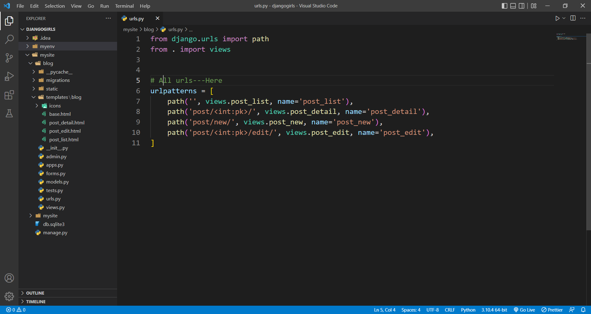
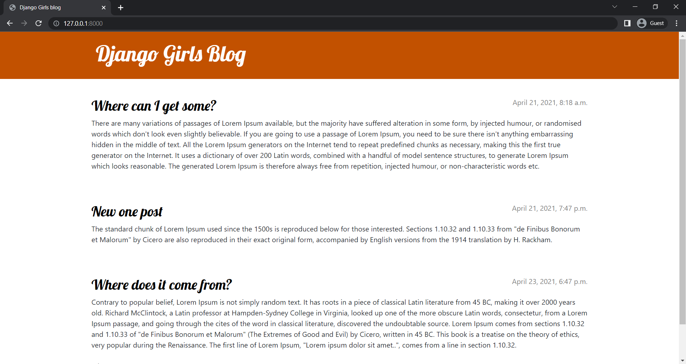
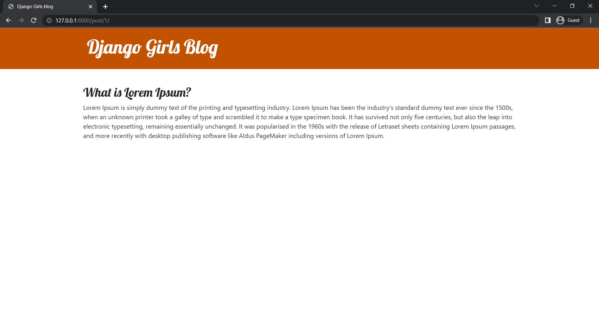
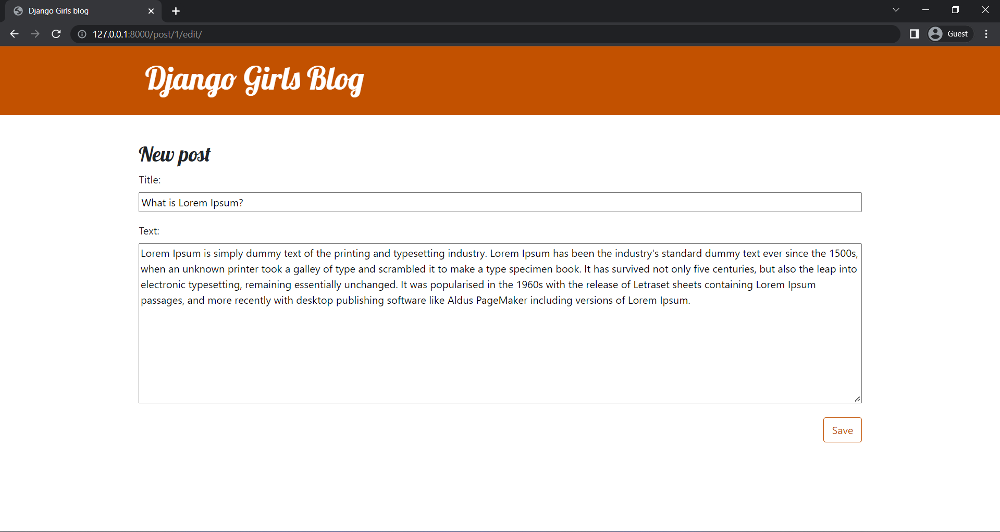
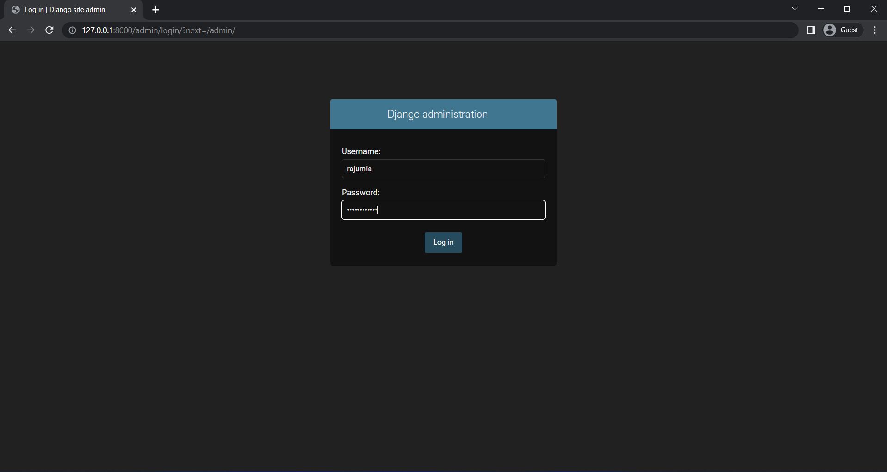
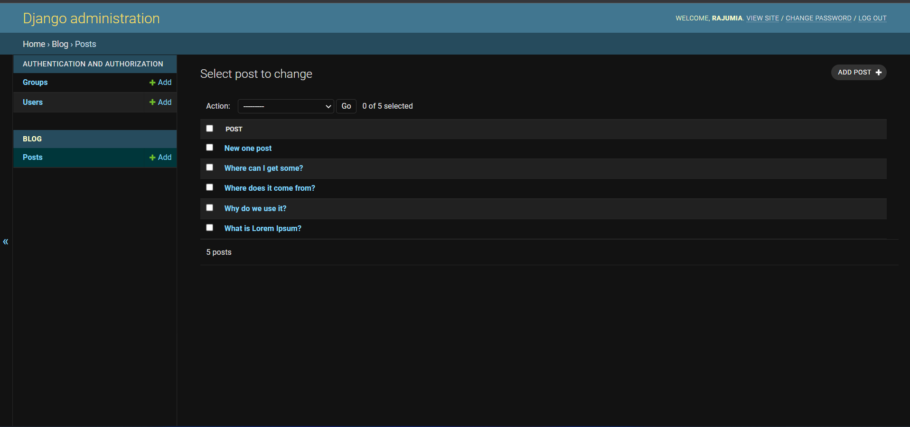

# -------------------djangogirls
## ⛳**Project Name**: Django Girls Blog

## 💡**Introduction**: A small working web application: own blog. available feature are , new blog add, edit, post. It's vary simple blog pages. 

# **Project View**:
----
> All kind of urls (code view):
    

> Home page  (BlOH site):
    

> Blog post search with primary key:
    

Blog post edit with primary key:
    

-----

## Admin panel view
---
> admin login (Admin Login Required):
    

> admin View (all post):
    
---

### THANKS- 🐧 
## ☑️Contact: [GitHub](https://github.com/Raju-Mia/django_girls_blog) ☑️Contact: [Linkedin](https://www.linkedin.com/in/rajumia/)